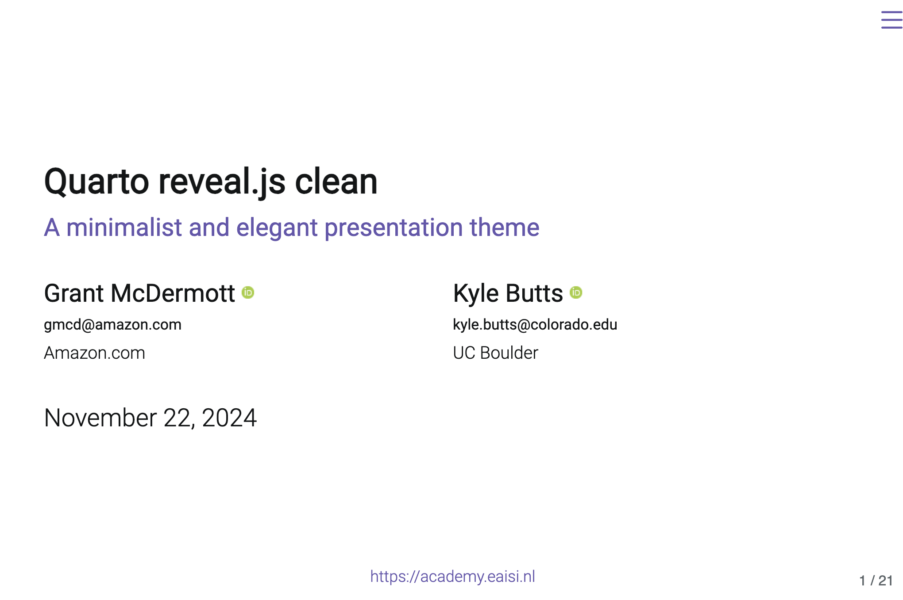

# Quarto clean theme

A minimalist and elegant presentation theme for Quarto Reveal.js, inspired by Kyle's
[LaTex template](https://raw.githack.com/kylebutts/templates/master/latex-slides/slides.pdf).

Click the screenshot below to be taken to a
[live demo](https://grantmcdermott.com/quarto-revealjs-clean-demo/template.html).

[](https://grantmcdermott.com/quarto-revealjs-clean-demo/template.html)

## Modified with EAISI colors

Theme is defined in `_extensions/grantmcdermott/clean/clean/css`:

```
$accent: #6656ad;
$accent2: #e54273;
```



## Use

Create a new repository from this template.
